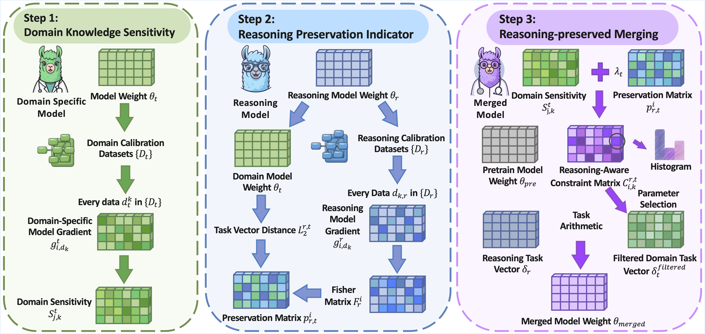

# RCP-Merging

[AAAI 2026 Main Track]: Official Code of "RCP-Merging: Merging Long Chain-of-Thought Models with Domain-Specific Models by Considering Reasoning Capability as Prior"

## Overview
This repository contains the code and resources for **RCP-Merging** (Reasoning Capability as Prior Merging), a novel framework designed to merge domain-specific Large Language Models (LLMs) with models possessing long Chain-of-Thought (CoT) reasoning capabilities.


<div align="center">
  

  **RCP-Merging Framework Overview:** RCP-Merging consists of three stages. (1) **Domain Knowledge Sensitivity**. This step quantifies each weight's importance for a specific domain by measuring the change in model loss when that weight is removed. (2) **Reasoning Preservation Indicator**. To protect the model's core reasoning capabilities, this stage applies a preservation term to weights that are crucial for reasoning. (3) **Reasoning-preserved Merging**. The final stage balances domain sensitivity and the reasoning preserving matrix, merging only the weights that enhance domain knowledge without harming reasoning capabilities.
</div>
- We propose a novel model merging framework, RCP-Merging, which effectively integrates a domain-specific model with a long CoT reasoning model by treating reasoning ability as a prior.
- We conduct extensive experiments across multiple benchmarks, demonstrating that RCP-Merging surpasses existing methods by preserving both specialized knowledge and long-CoT reasoning capabilities.
- Results surprisingly demonstrate that models merged via RCP-Merging exhibit emergent long CoT reasoning capabilities within model outputs when handling domain-specific problems.
  
## Repository Structure

### 1. `baselines/`
This directory contains baseline implementations for model merging. It includes the following subdirectories:

- **`examples/`**: Contains YAML configuration files for different merging methods, such as `dare_linear.yml` and `ties.yml`. These files specify model paths, weights, and merging parameters.
- **`catmerge/`**: Implements the `cat_merge.py` script for merging models using concatenation techniques. Users need to configure environment variables for paths and hyperparameters before running the script.
- **`sensmerge/`**: Implements the "Sens-Merging" algorithm. This method calculates task-specific sensitivities and alignment scores to derive optimal merging coefficients.
- **`mergekit/`**: Provides utilities and scripts for advanced merging techniques. (Note: The README for this directory is missing.)
Dependencies can be installed using:
  ```bash
  pip install torch transformers tqdm
  ```

### 2. `evaluation/`
This directory contains scripts for evaluating merged models on various datasets. For example:
- **`experiment_ARC.py`**: Evaluates models on the ARC-Challenge dataset. Users need to specify model paths and prompts for different model types (e.g., Qwen, Llama).

### 3. `gibberish/`
This directory includes tools for detecting gibberish in model outputs. Key files:
- **`detect_gibberish.py`**: Python script for gibberish detection.
- **`gibberish_detector_pubmed.py`**: Specialized script for detecting gibberish in PubMed data.

### 4. `requirements.txt`
Lists all dependencies required for the repository. Install them using:
```bash
pip install -r requirements.txt
```

## Getting Started

### Step 1: Clone the Repository
```bash
git clone https://github.com/ZeroNLP/RCP-Merging
cd RCP-Merging
```

### Step 2: Set Up the Environment
Ensure you have Python 3.10 installed. Create and activate a virtual environment:
```bash
conda create -n merge_model python=3.10 -y
conda activate merge_model
```

### Step 3: Install Dependencies
Upgrade `pip` and install all required packages:
```bash
pip install --upgrade pip
pip install -r requirements.txt
```

### Step 4: Run Scripts
- **Model Merging**: Navigate to `baselines/` and run the desired merging script (e.g., `cat_merge.py`). Ensure all environment variables are set.
- **Evaluation**: Navigate to `evaluation/` and execute the relevant experiment script (e.g., `experiment_ARC.py`).
- **Gibberish Detection**: Navigate to `gibberish/` and run the detection scripts.

## Notes
- Ensure all paths in configuration files and scripts are updated to match your local setup.
- Refer to individual README files in subdirectories for more details.

## Contributing
Contributions are welcome! Please submit a pull request or open an issue for discussion.

